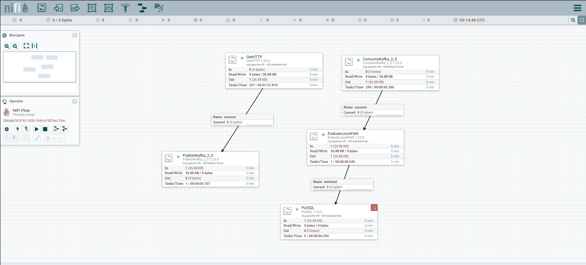

# Ekofin

**Ekofin** is a project that demonstrates how to retrieve data from the jsonplaceholder API, process it, and send it to Kafka.

## Project Overview

The project includes the following main components:

1. **Data Retrieval**: Data is fetched from the **jsonplaceholder API** using **Apache NiFi**.
2. **Data Streaming**: The retrieved data is sent to **Kafka** for real-time streaming and processing.
3. **Data Reception**: Data is retrieved from Kafka through **NiFi**.
4. **Data Storage**: Processed data is written to a **PostgreSQL** table.

## Deployment

The entire architecture is deployed on a **Linux** system using **Docker**, providing a consistent and portable environment.

## Technologies Used

- **Apache NiFi**
- **Kafka**
- **PostgreSQL**
- **Docker**

## Getting Started

To get started with this project:

1. Clone the repository.
2. Follow the instructions in the `README.md` file to set up the Docker environment.
3. Run `docker-compose up --build` in the terminal to start the project.
4. Navigate to `localhost:8080/nifi` to view the project.

## NiFi Flow Diagram

The project's **NiFi flow diagram** is available in the following file:

